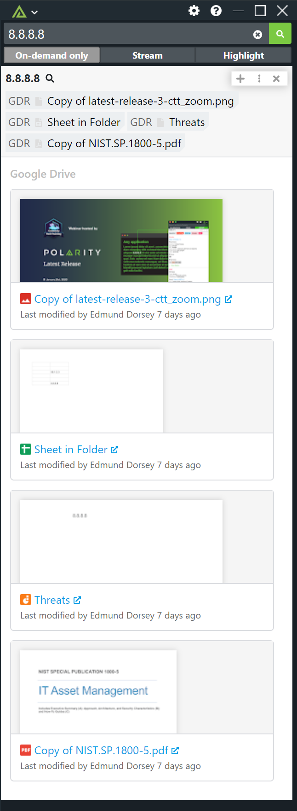

# Polarity Google Drive Integration


Polarity's Google Drive integration gives users the ability to search files stored in a specified Google drive folder. This integration leverages the v3 drive API.



## Installation Instructions

Installation instructions for integrations are provided on the [PolarityIO GitHub Page](https://polarityio.github.io/).

## Configuring the Integration

You will need to configure a Google service account key and perform the following steps.

### Create the Project and Service Account

Before you can use the Polarity Google Drive Integration you will need to go to the [Google Developers Console](https://console.developers.google.com/) and create a new project. Provide a name for your project and an ID, which can be generated as well.

After the project has been created, from the left menu, select `Credentials`, then `Create credentials`. Select `Service account key` from the type of credentials list. After this, choose `New service account` from the dropdown and name the service account `polarity-gdrive`.  Under the role selection, choose `Service Accounts -> Service Account User`.  Select `JSON` as the key type and hit the `Create` button which will trigger the download of the JSON private key.


#### Enable the API

Next we need to enable the API which will be used with this service account. To do that, select Library from the left menu and then search for “Google Drive API” and press the Enable button.


#### Transfer Service Account Key to Polarity server

SSH into the Polarity Server as root and navigate to the Google Drive integration subdirectory:

```
cd /app/polarity-server/integrations/google-drive/
```

Create a new directory named `key` and upload the service account key created in Step 1 above, or optionally copy the contents of the key file into a new file named `privatekey.json`.  After the key file has uploaded or created, make the `key` directory and it's contents owned by the polarityd user:

```
chown -R polarityd:polarityd /app/polarity-server/integrations/google-drive/key/
```

> PLEASE NOTE: If the key file is not explicitly named `privatekey.json` or is placed in an alternate location, the integration configuration file (config.js) needs to be modified to reflect this change.

```
auth:{
    // Path to google drive private key file
    key: './key/privatekey.json'
}
```

## Integration Options

### Search Scope

The search scope for the integration dictates which files or Tream Drives will be searched.  There are three possible options:

* [Default] Search specific files the service user has access to

If this option is selected the integration will only search files that have been explicitly shared with the service user email address.

> Team Drive does not support sharing folders.  If you want to share all files under a folder you will need to add the service user
to the entire Team Drive and then choose the [Specific Drive] or [All Drives] options.

* [Specific Drive] Search the specified Team Drive ID (must fill in the `Drive ID to Search` option)

Search the specific drive specified by the `Drive ID to Search` option (see below).  If this option is selected, you must provide the
Drive ID to search.  The Drive ID can be determined by looking at the Team Drive URL in your browser.

```
https://drive.google.com/drive/u/1/folders/0BLCYu7N598nTUk9PVA
```

The drive ID here is `0BLCYu7N598nTUk9PVA`.

> Note that the service user must be given access to the specified Team Drive.

* [All Drives] Search all Team Drives the service user has access to

If selected, the service user will search all drives they've been access to.


### Drive ID to Search

The ID of the Team Drive to search.  This option only has an effect if the `Search Scope` option is set to `[Specific Drive]`

### Get File Content
If checked, file results will display a content of the found file if available. 
> NOTE: This could increase search time


## About Polarity

Polarity is a memory-augmentation platform that improves and accelerates analyst decision making.  For more information about the Polarity platform please see:

https://polarity.io/
